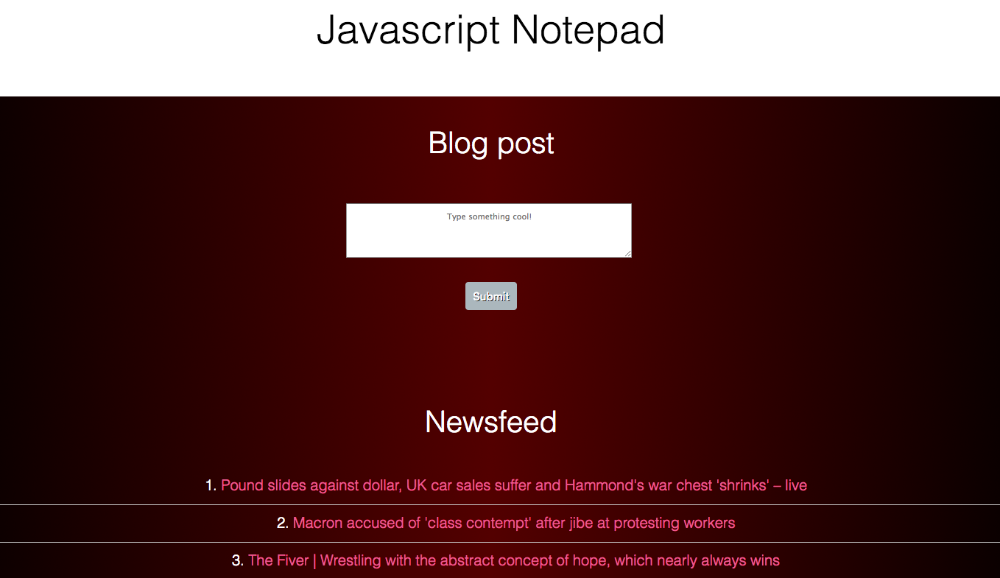

NotePad with a News API
===========



Getting Started
------------

To clone the repo and install the dependencies follow the steps below

```
$ git clone https://github.com/david-div/DwepsNotePad.git
$ cd DwepsNotePad
$ npm install
```

Viewing
--------

Start the server with ```http-server``` and navigate to http://localhost:8080/views/NotePad.html in your browser.


Testing
-----------
Start your server with ```http-server``` command and navigate to http://localhost:8080/SpecRunner.html in your browser to show the tests.
